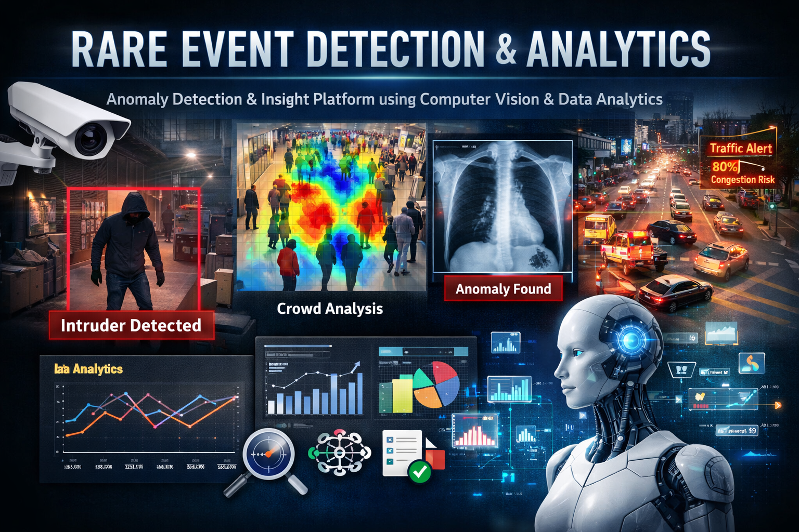

# Rare Event Computer Vision Analytics Platform  

<p align="center">
  
</p>

## Overview

This research project focuses on **Computer Vision–driven analytics for detecting, simulating, and analyzing rare, high-impact visual events** in images and video streams. The goal is to bridge the gap between *visual perception models* and *decision-level analytics*, enabling reproducible research and real-world deployment.

The platform combines **synthetic data generation, deep learning–based vision models, and downstream analytics dashboards** to study events that are difficult to capture in real life due to rarity, cost, or safety constraints.


## Research Objectives

* Detect **low-frequency, high-impact visual anomalies** in video streams
* Generate **synthetic rare events** to improve model robustness
* Quantify uncertainty, confidence, and event impact
* Translate vision outputs into **actionable analytics and KPIs**
* Enable reproducible experiments and benchmarking


## System Architecture

**Pipeline**:

1. Video / Image Ingestion (real + synthetic)
2. Preprocessing & Augmentation
3. CV Models (Detection, Segmentation, Anomaly Detection)
4. Feature & Event Extraction
5. Analytics & Metrics Engine
6. Visualization & Reporting


## Core Components

### 1. Synthetic Rare Event Generator

* Procedural insertion of anomalies (objects, motion, occlusion, lighting)
* Physics-aware transformations
* Domain randomization

**Output**: Annotated datasets with ground truth labels


### 2. Computer Vision Models

* Object detection: YOLOv8 / Faster R-CNN
* Anomaly detection: Autoencoders, PatchCore
* Temporal models: ConvLSTM, Video Transformers

**Metrics**:

* Precision / Recall / F1
* Event-level false positives
* Time-to-detection


### 3. Analytics Layer

* Event frequency & severity scoring
* Trend analysis over time
* Confidence-weighted aggregation
* Risk scoring and prioritization

**Technologies**:

* Pandas / NumPy
* Scikit-learn
* Statistical modeling


### 4. Visualization & Dashboards

* Event timelines
* Heatmaps & spatial density maps
* Model confidence distributions
* Executive KPIs

Tools:

* Streamlit / Dash
* Plotly


## Research Questions

* How does synthetic data impact rare-event detection performance?
* What confidence thresholds minimize operational false alarms?
* How stable are models under domain shift?
* Can analytics-derived signals outperform raw CV predictions?


## Datasets

* Public datasets: UCF-Crime, Avenue, ShanghaiTech
* Synthetic datasets generated in-house
* Custom benchmark splits for rare-event evaluation


## Reproducibility

* Fixed random seeds
* Versioned datasets
* Experiment configs (YAML)
* Dockerized environment


## Repository Structure

```
cv-rare-event-analytics/
├── data/
│   ├── raw/
│   ├── synthetic/
│   └── processed/
├── models/
│   ├── detection/
│   ├── anomaly/
│   └── temporal/
├── analytics/
│   ├── metrics/
│   └── risk_scoring/
├── dashboards/
├── experiments/
├── docker/
├── notebooks/
└── README.md
```


## Deliverables

* Research-grade CV + analytics pipeline
* Benchmark results & ablation studies
* Interactive analytics dashboards
* Publication-ready figures
* Enterprise-ready architecture


## Potential Applications

* Security & surveillance intelligence
* Industrial safety monitoring
* Infrastructure risk analytics
* Smart city operations
* Executive decision-support systems


## License

Apache 2.0


## Author

Atsu Vovor  
Consultant, Data & Analytics    
✉️ atsu.vovor@bell.net    
🔗 <a href="https://www.linkedin.com/in/atsu-vovor-mmai-9188326/" target="_blank">LinkedIn</a> | <a href="https://atsuvovor.github.io/projects_portfolio.github.io/" target="_blank">GitHub</a> | <a href="https://public.tableau.com/app/profile/atsu.vovor8645/vizzes" target="_blank">Tableau Portfolio</a>    
📍 Mississauga ON      

### Thank you for visiting!🙏
